---
output:
  xaringan::moon_reader:
    yolo: false
    lib_dir: libs
    css: xaringan-themer.css
    seal: false
    nature:
      autoplay: 60000
      countdown: 60000
      highlightStyle: github
      highlightLines: true
      highlightSpans: true
      countIncrementalSlides: false
      #ratio: 16:9
      slideNumberFormat: "%current%"
editor_options: 
  chunk_output_type: console
---

```{r setup, include=FALSE}
options(htmltools.dir.version = FALSE)

knitr::opts_chunk$set(echo = TRUE, 
                      tidy = 'styler', 
                      comment = NA,
                      message = FALSE,
                      warning = FALSE)
```


```{r xaringan-themer, include=FALSE, warning=FALSE}
library(xaringanthemer)
style_duo_accent(
  primary_color = "#1381B0",
  secondary_color = "#FF961C",
  inverse_header_color = "#FFFFFF"
)

# Loaded packages and libraries
#------------------------------
  if (!require("pacman")) install.packages("pacman")
  pacman::p_load(knitr,styler,icons ,xaringanExtra,xaringan, tidyverse, kableExtra, countdown, janitor)


xaringanExtra::use_xaringan_extra(include = c("tile_view", "editable", "share_again", "broadcast", "animate_css", "panelset", "tachyons", "fit_screen", "clipboard", "search", "scribble", "freezeframe"))


use_webcam(width = 150, height = 150)

use_extra_styles()
```

background-image: url(images/Rcoder.jpg), url(images/consultancy.jpg),url(images/image-modified.png)
background-position: 50% 100%, 100% 0%, 0% 0%
background-size: 50%, 30%, 12% 

class: title-page, center, middle

## Training Workshop on R for Data Science.

## Modules: Foundation of Data Worflow in R


`r format(Sys.time(), '%d %B, %Y')`

```{r, echo=FALSE}
use_logo(
  image_url = "images/consultancy.jpg",
  link_url = "https://mgisa.github.io/myblog",
  position = xaringanExtra::css_position(top = "1em", right = "1em"),
  exclude_class = c("title-page", "inverse", "hide_logo")
)
```

---
class: about-me-slide, inverse, middle, center

## About Facilitator


### Murera Gisa

#### Data Scientist, ML Engineer

.fade[National Bank of Rwanda (BNR), AIRA Analytics(Uganda) <br> Home-based Consultancy]

[`r icons::fontawesome("link")` @myblog](https://mgisa.github.io/myblog)
[`r icons::fontawesome("twitter")` @gisa_murera](https://twitter.com/gisa_murera)
[`r icons::icon_style(icons::fontawesome("github"), scale = 1)` @mgisa](https://github.com/mgisa)
[`r icons::icon_style(icons::fontawesome("phone"), scale = 1)` 0788266517](https://github.com/mgisa)
[`r icons::icon_style(icons::fontawesome("handshake"), scale = 1)` elgisamur@gmail.com](https://mgisa.github.io/myblog)

???

class: about-me-slide, inverse, middle, center

---
class: middle

.w-100.lh-copy[

About the Course:

> In this course we hope to demystify the idea that coding is difficult. We want to upskill all participants in order for them to understand how code used in basic data analysis.

> Coding section: Equip with trainees the new Software `R` for implementing some of data analytics worflow (from descriptive to the  Predictive). 
Data flow Source to Production

]

---
class: middle

.w-100.lh-copy[

Goal:

- Upskill all participants to understand code used in the data pipeline

> The training only aims to serve as a foundation for participants' R coding journey.

- Familiarisation with data pipeline

> Upskill all participants to understand code used in the data pipeline


]


---
class: middle

.w-100.lh-copy[

Key outcomes:

At the end of this training, participants will be able to:

> Have a basic understanding of the R code used in a data pipeline.

> Understand the flow of data analysis pipeline.

> Being able to do a basic exploratory analysis

> unleash the power of `Tidyverse` ecosystem. 

> Connect from DB and analyse data from R

> Take analysis to the next level through automation and presentation in R {xaringan} library.

]

---
class: middle

.w-100.lh-copy[

Asking assistance

> PLZ!!! Ask questions, we've been down this road before!

> Please feel free to stop me and ask a question.

> If you feel more comfortable asking questions in writing feel free to email them to `elgisamur@gmail.com`

> Help each other out! Some might be further along their data journeys than others.

]

---
class: middle

.w-100.lh-copy[

Summary:

> Have a basic understanding of the R code used in a data pipeline.

> Understand the flow of data analysis pipeline.

> Being able to do a basic exploratory analysis. 

> Visualize data using {ggplot2}.

> Create slides that automate reports.

]


---
class: inverse, middle
name: toc


# Table of content

.w-100.lh-copy[

- [Day1: Setting of working environment and Introduction to R basics](#beg0)

- [Day2: Data Cleaning, Visualization and Databases](#beg1)

- [Day3: Automatic data report and presentation](#beg2)
]

---

class: middle, center, inverse
name: beg0

# Introduction and R basics

---

```{r, out.width= "85%", out.height="90%", echo=FALSE, eval=FALSE}
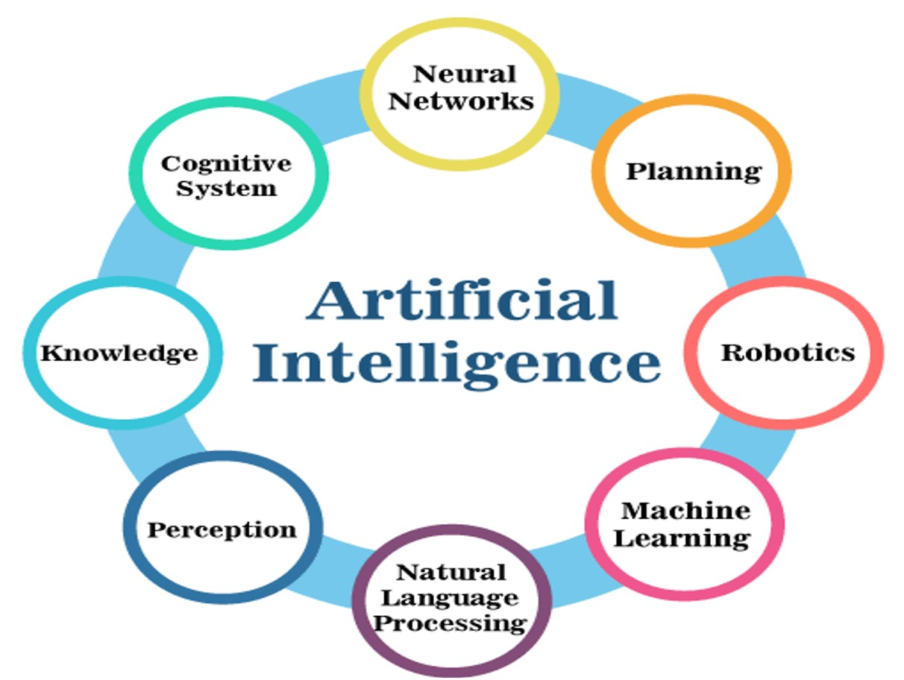
```

---

class: middle, center, inverse

# Data, Tools and Techniques

---

class: middle

.w-100.lh-copy[

Objectives:

> Understand the world data revolution, explosion and data flow,

> Understand Big Data, tools and Techniques,

> Why open source? Migrate form EXCEL to R

> Navigate web browser, download and install R and Rstudio,

> Set a data analysis working directory and interactive project,

> Import data, clean it, aggregate and plot it,

> Learn how to use the grammar of graphics, literature programming, and Data tabulating (`tidyverse`).

]

---
class: middle

## World Data Explosion 

.w-100.lh-copy[
The world data comes in various ways,types, shapes, forms and sizes.
]

--

.w-100.lh-copy[
In $2020$, the world data was estimated at $45$ Zettabytes ( $45$ Millions GBs).
]
--

.w-100.lh-copy[
The amount of data generated daily is expected to reach $465$ exabytes ( $465$ Billions GBs) by $2025$.
]

--

.w-100.lh-copy[

It will keep to increase and requires an extremely huge elastic cloud servers to store and save them.
]

--

.w-100.lh-copy[
Therefore AI and Data Science is going to be a relevant tech to serve the world with such huge data.
]

---

## Data Flow 

.panelset[
.panel[.panel-name[Static Flow]


```{r, out.width= "70%", out.height="55%", echo=FALSE}
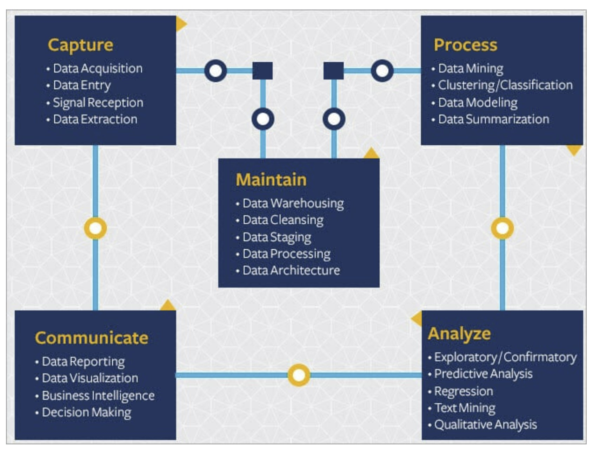
```

]
.panel[.panel-name[Animation Flow]

[HERE](https://drive.google.com/file/d/1us0yQ_CFv5xg2XArSim_H77Oq4exf1Im/view)

]
]

---

class: middle

## Data Science

.w-100.lh-copy[
It is acknowledged that all sectors are bombarded by huge amount of data(__Big Data__).
]

--

.w-100.lh-copy[
That data means nothing till it will be analysed and interpreted to support policy making. 
]

--

.w-100.lh-copy[
This requires science, tools and techniques (Data Science) to deal with such big data to find:
* hidden patterns, 
* derive meaningful and insigthful information, and 
* make business and policy decisions.
  ]
  
--

.w-100.lh-copy[
The data scientist are at forefront of the latest tech revolution and find the hidden information from the big data.
]

--

.w-100.lh-copy[
* Example of data-driven projects: Chatbot, Sentiments and Emotions, Automatic data Reporting and dashboard,Robotics, MLOps, Etc...
]

---
class: middle 

## Data Science Skills

```{r, out.width= "80%", out.height="70%", echo=FALSE}
knitr::include_graphics("images/datascience.jpg")
```
---
class: middle 

## Why Open Source?

- Open source software such as R has a very large and active communtity
  - This means that the velocity of new package being made available is growing and an almost exponential rate
- This also means that the access to the latest statistical techniques is available in R with extensive documentation
- Specialized procedures is where the R community's strength lies
- Besides the direct community of R developers, there are online forums which play a significant role in the development of the software as well as you as a user

---
class: middle

- These forums give insight into practical solutions to problems and are easily accesible through the use of google:
  - Go and explore [Stackoverflow](https://stackoverflow.com/)
  - Dont be afraid to ask
- Open source also allows for the construction of bespoke software to use in-house.
- How to receive the latest information on what people are doing
  - [R-Blogers](https://www.r-bloggers.com/)
  
---
class: middle

## Why move away from Excel?

- Excel is a general point and click camera setup
- Reliability is not its main focus; same can be said for reproducibility
- Platform is unfortunately slow as it contains a lot of overhead
- Excel has a very limited capacity and is memory intensive as it is reactive
- Fundamental flaws:
  - Solver gives the wrong result about 40% of the time
  - Random number generation is not always random
  - Documentation is sparse
  
---
class: middle

## Why R?

- R is an Open Source
- The capabilities of the program provides the necessary toolset for data analysis. The most obvious is the plotting features
  - Histogram
  - Boxplot
  - Barchart
  - LOESS smoothing of data
---
class: middle

## Tools and Software

.w-100.lh-copy[
There existing different tools and software to analyze the data
* Python and R
* STATA and SPSS
* Julia and Matlab
* Others
]

--

.w-100.lh-copy[
Intentionally, in this training we are going to learn and use R programming as tool for Data Science.
]

---
class: middle

## What is R programming

```{r, out.width= "80%", out.height="70%", echo=FALSE}
knitr::include_graphics("images/RIhaka.png")
```


.w-100.lh-copy[
R is designed to perform a very complex statistical analysis and display results using visual graphics and tables.
]

---
class: middle

## What is RStudio?

.w-100.lh-copy[
RStudio is an integrated development environment (IDE) for R
programming. And it makes programming easier and friendly in R
]

```{r, out.width= "85%", out.height="90%", echo=FALSE}
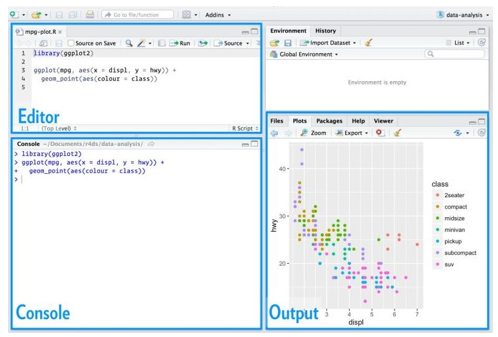
```

---
class: middle

## Installation and Testing

* Download R [HERE](https://cran.r-project.org/bin/windows/base/)
--

* Download RStudio a.k.a Posit [HERE]( https://www.rstudio.com/products/rstudio/download/)
--

* Install both R and Rstudio by running the downloaded executable files from your PC Downloads folder.

---
class: middle

## Useful terminology of workshop

```{r, out.width= "85%", out.height="90%", echo=FALSE}
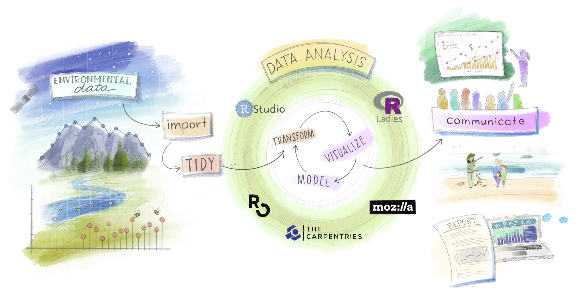
```

---
class: middle, center, inverse
name: beg2

## R packages and library


```{r, echo=FALSE}
knitr::include_graphics("images/packages.png")
```

---

layout: true

## R packages and library

---

.w-100.lh-copy[
A package is a collection of R functions that extends basic R functionality (`base::functions`).
]

--

.w-100.lh-copy[
A package can contain a set of functions relating to a specific topic or tasks.
]

--

.w-100.lh-copy[
For example, data wrangling packages include `tidyr`, `janitor`, etc.
]

--

.w-100.lh-copy[
The location where the packages are stored is called a **library**. If there is a particular package that you need, you can install the package from the Comprehensive R Archive Network (**CRAN**) by using:
]
--

```{r, eval=FALSE}
install.packages("pkg_name")
```
--

For example:

```{r, eval=FALSE}
install.packages("tidyverse")
```
--
.w-100.lh-copy[
Please note that the package name must be put on double quotes (**" "**) or a single quote (**' '**).
]

---

.w-100.lh-copy[
Other packages that are not yet on `CRAN` can also be installed from an external repository such as **GitHub** or **GitLab** by using `devtools` or `remotes` packages.
]

--

For example, package `fakir` is not yet on `CRAN`. 
--
 To install `fakir` from the `GitHub` repository,

--
use

--

```{r, eval=FALSE}
devtools::install_github("ThinkR-open/fakir")
```
--

or

--
```{r, eval=FALSE}
remotes::install_github("ThinkR-open/fakir")
```

--

.w-100.lh-copy[
You can also use `devtools` or `remotes` to install development version of a package. 
]

--

```{r, eval=FALSE}
remotes::install_github("datalorax/equatiomatic")
```

---
layout: false

## Import or load a package

.w-100.lh-copy[
Before you can use any installed package, you will need to import or load them by using the command:
]

--

```{r, eval=FALSE}
library(pkg_name)
```
--

.w-100.lh-copy[
which makes that package functions available for you in the R session or environment.
]

--

For example:

--

```{r, eval=FALSE}
library(tidyverse)

library(janitor)

library(ralger)
```

---
background-image: url(images/package.png)
background-size: contain
background-position: 60% 60%

### Think of R package as this:

.w-100.lh-copy[
You only need to install a package once, but you need to reload it every time you start a new session.
]
---
class: middle 

## R Library

.w-100.lh-copy[
Library is a directory where the packages are stored. You can have multiple libraries on your hard disk.
]

--

To see which libraries are available (which paths are searched for packages), use:

--

```{r}
.libPaths()
```
---
class: middle

## Remove installed packages

Remove installed packages/bundles and updates index information as
necessary.

```{r, eval=FALSE}
remove.packages("pkg_name")
```
---

### Use a function from an external package without loading it	


.w-100.lh-copy[
There are two ways to make use of a function in a package. You can
load the package with `library(pkg_name)` and then use any of its `functions`. For example:


```{r, eval=FALSE}
library(install.load)

install_load(c("tidyverse", "janitor", "ralger"))
```

]

--

.w-100.lh-copy[
Or you can use the `::` operator to attach a function to a library i.e. `mypackage::myfunction()`. For example:


```{r, eval=FALSE}
install.load::install_load(c("tidyverse", "janitor", "ralger"))
```

]

--

.w-100.lh-copy[
It is often common to see people using `mypackage::myfunction()` so that the reader of a script can know which function belongs to a particular package.
]

---
class: middle

### Example 1

```{r, eval=FALSE}
library(janitor)

first_5_iris <- head(iris, 5)

clean_names(first_5_iris)
```

```{r, echo=FALSE}
iris %>% head(5) %>% clean_names() %>% kable()
```

---
class: middle

### Example 2

```{r, eval=FALSE}
first_5_iris <- head(iris, 5)

janitor::clean_names(first_5_iris)
```

```{r, echo=FALSE}
iris %>% head(5) %>% clean_names() %>% kable()
```

---

class: middle, center, inverse
name: beg3

# RStudio project

.w-100.lh-copy[
Data Analysis Reproducibility with R and RStudio Project.
]

```{r, echo=FALSE}
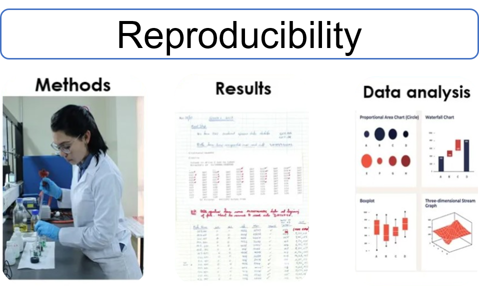
```


---
layout: true

## Where Does Your Analysis Live?

---

.w-100.lh-copy[
The working directory is where R looks for files that you ask it to load, and where it will put any files that you ask it to save.
]
--

RStudio shows your current working directory at the top of the console:

```{r, out.width= "60%", out.height="5%", echo=FALSE}
include_graphics("images/console.png")
```
--

<br>

and you can also print this out by using:

--

```{r}
getwd()
```
---
class: middle

.w-100.lh-copy[
If you have specific directory that you want to use as your working
directory, in `R` you can do that with the command `setwd()` e.g.
`setwd("/path/to/my/data_analysis")`
]
--

.w-100.lh-copy[
or by using the keyboard shortcut  `Ctrl+Shift+H` and choose that
specific directory (Folder).
]

---
layout: false

## Paths and Directories

- .w-100.lh-copy[**Absolute paths**: This looks different in every computer. In Windows they start with a drive letter (e.g., `C:`). In my R working directory I have `r getwd()` as absolute path.
]
--

.w-100.lh-copy[
You should never use *absolute paths* in your scripts, because they hinder sharing and no one else will have exactly the same directory configuration as you.
]

--

- .w-100.lh-copy[**Relative paths**: With the help of function `here::here()` or `R project` or `getwd()`
we can have a relative path like `data/datafile.csv` that
allows for file sharing and collaboration.
]

---

## RStudio Projects
.w-100.lh-copy[
For a typical data science workflow, you should use Rstudio project.
R experts keep all the files associated with a project together—like data
folder, R scripts folder, analytical results folder, figures folder. This is such
a wise and common practice.
]

--

```{r, out.width= "80%", out.height="25%", echo=FALSE}
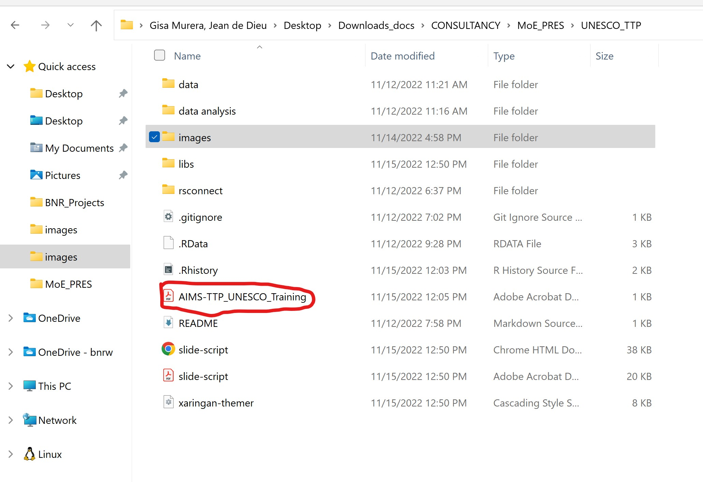
```

---

## Creating a new R project

Click `File → New Project`, then choose Existing Directory:

```{r, out.width= "80%", out.height="25%", echo=FALSE}
include_graphics("images/step1.PNG")
```

---

Browse for that specific directory (Folder).

--

```{r, out.width= "80%", out.height="40%", echo=FALSE}
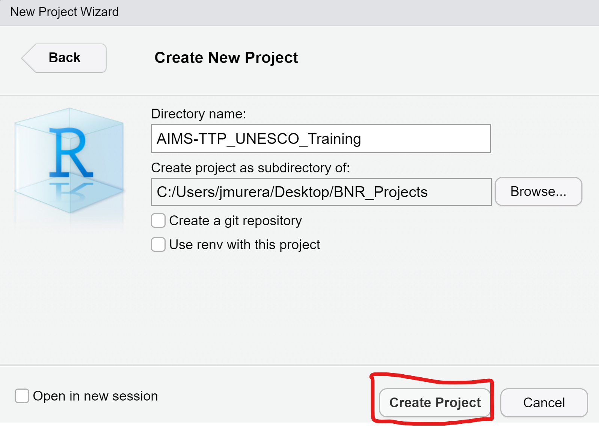
```

---
class: middle

```{r, echo=FALSE, out.height="50%", out.width="80%"}
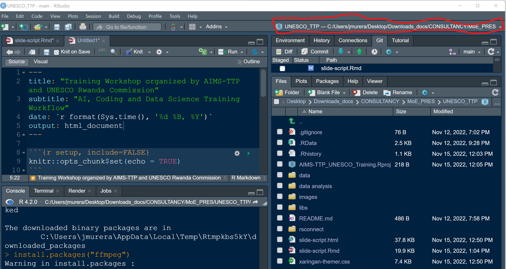
```

--

Hurray! We are in the `RStudio project`.


---
class: middle

```{r, out.width= "80%", out.height="20%", echo=FALSE}

```

Henceforth, you will click `.Rproj` to open RStudio project.


---

class: middle, center, inverse
name: beg4

# Reading and writing data in R

```{r, echo=FALSE, out.height= "50%", out.width= "60%"}
include_graphics("images/export.png")
```
---
layout: true
## Reading and writing data in R

---
.w-100.lh-copy[
Creating a dataframe from scratch is so tedious. In the data science world, data will be available for you on a spreadsheet such as MS-Excel. Our job as a data scientist is to import those datasets into R using any data import packages such as `readr` (.csv), `readxl` (.xlsx), `haven` (.sav, .dta), `rio` (any data file format), or `ralger` (web data).
]

--
.pull-left[

```{r, echo=FALSE, out.height= "100%", out.width= "100%"}
include_graphics("images/import.png")
```
]

--

.pull-right[

.w-100.lh-copy[
Please note that `readr`, `readxl`, and `haven` are part of `tidyverse` set of packages. You can see all the packages in the tidyverse by using:

```{r, eval=FALSE}
tidyverse::tidyverse_packages()
```

]
]
---

- `readr` package:
  - `read_csv()` import a `.csv` file to R 
  
  - `write_csv()` export a dataframe as `.csv` file out of R

--

- `readxl` package:

  - `read_xlsx()` import a `.xlsx` file to R

--

- `writexl` package:
  - `write_xlsx()` export a  dataframe as`.xlsx` file out of R 

--

- `haven` package:

  - `read_sav()` import a `.sav` file to R

  - `write_sav()` export a dataframe as `.sav` file out of R 
  
  - `read_dta()` import a `.dta` file to R

  - `write_dta()` export a dataframe as `.dta` file out of R  
  
---

- `rio` package
  
  - `import()` import any file format to R
  
  - `export()` export a dataframe as any file format out of R
  
For more information on `rio` package, please visit this [resource](https://www.rdocumentation.org/packages/rio/versions/0.5.26).

--

### RStudio Project

.w-100.lh-copy[
To import and export data in R, we will make use of the `RStudio project`, to automatically set up the working directory, and utilize the relative path for the data file path.
]

---
layout: false

### Lab session

```{r, echo=FALSE}
include_graphics("images/lab.png")
```
---
layout: false
class: middle

## Summary

.w-100.lh-copy[
Data science workflow can be done in Rstudio project. This enables you to organize your files i.e. keep data files, the script, save the outputs and by using only relative path.
]
--

.w-100.lh-copy[
Everything you need is in one place, and cleanly separated from all other projects you are working on.
]

--

.w-100.lh-copy[
You can comfortably install any R packages be it on the `CRAN` or `GitHub` and load them to the R environment.
]

--

.w-100.lh-copy[
Now, you can import any file format to R and also export it out.
]


---
class: center, middle, inverse
name: beg5

# Tidyverse Package Ecosystem

---
class: middle

.w-100.lh-copy[

Objectives:

> What is a tidyverse, 

> tidyverse libraries,

> Hands on case studies

]

---
class: center, middle

### What is tidyverse

.w-100.lh-copy[

> The tidyverse is an opinionated collection of R packages designed for data science. All packages share an underlying design philosophy, grammar, and data structures.

]

--

.w-100.lh-copy[

> This collection contains some of the most used libaries that an `R` data scientist will use on a daily basis. The most used packages are probably `dplyr` and `ggplot`. Today we gonna explore the basics of the `dplyr` package.

]
---
class: center, middle

## Tidyverse CONT'D
 
> `dplyr` is the grammar of data manipulation (`select`, `filter`, `group_by`, `mutate`, `summarise`, `arrange`)

> ggplot is the grammar of graphics. 

> Beyong the scope of this workshop, below are some resources;

  - [R for Data Science](https://r4ds.had.co.nz/)
  - [ggplot](https://ggplot2-book.org/)
  

---
class: center, inverse, middle

## Recommendations

> We recommend `R` for data analyses due to its firm pedigree in statistical analysis. `Python` is getting better at manipulating data with packages like `pandas` and `alike`, while `R` has become a more general language over the last few years.

> Even though python does offer some nice integration features, `R` offers a much better ecosystem that supports reproducible research and data analysis (`Rmarkdown`, `blogdown`, `targets`, `distill` etc. ).

---
class: center, inverse, middle

## Hands on case studies

```{r, out.width= "70%", out.height="10%", echo=FALSE}
# Variables
company <- c("A", "A", "A", "B", "B", "B", "B")
cash_flow <- c(1000, 4000, 550, 1500, 1100, 750, 6000)
year <- c(1, 3, 4, 1, 2, 4, 5)

# Data frame
cash <- data.frame(company, cash_flow, year)

# Print cash
cash

# Operation on df: subsetting, str, add new column, rename, column
```

---
class: center, middle

## Present value of projected cash flows

> Time for analysis

- If you expect a cash flow of $100\$ $ to be received $1$ year from now, what is the present value of that cash flow at a $ 5\% $ interest rate? 

- To calculate this, you discount the cash flow to get it in terms of today's dollars. The general formula for this is:

```{r}
#present_value <- cash_flow * (1 + interest / 100) ^ -year

#95.238 = 100 * (1.05) ^ -1


```

- If you expect to receive $4000 in 3 years, at a 5% interest rate, what is the present value of that money? Follow the general formula above and assign the result to present_value_4k.

---
class: middle

```{r}
# Present value of all cash flows
cash$present_value <- cash$cash_flow * (1.05) ^ -cash$year

# Print out cash
cash
```

> [dplyr Resource](https://www.rdocumentation.org/packages/dplyr/versions/0.7.8) 

---
class: middle
## Tidy your data

```{r, echo=FALSE, out.height="50%", out.width="80%"}
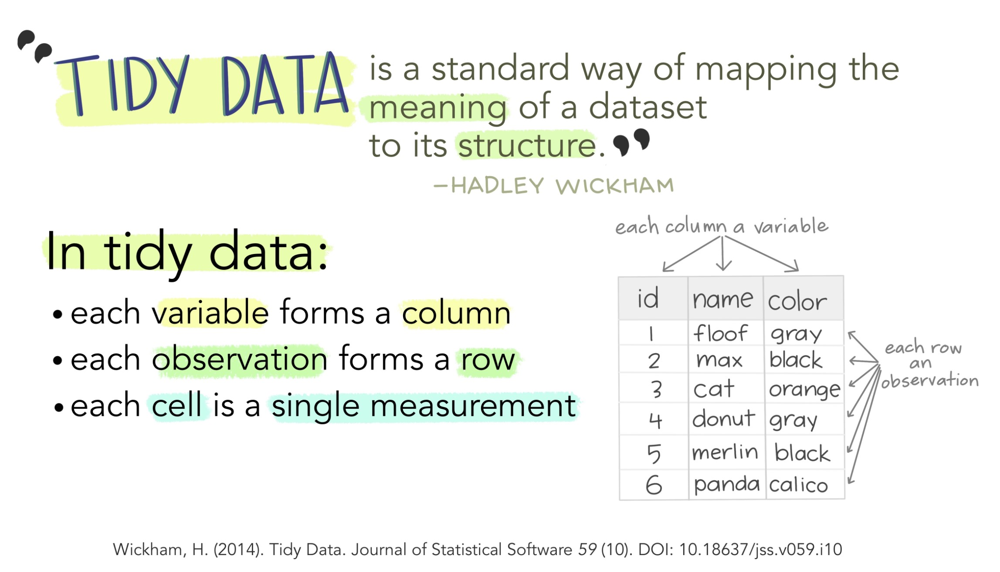
```

[TidyR](https://posit.co/blog/introducing-tidyr/)

---
## Manipulation of data by tidyr

> pivot_longer()

It is probably one of the most used functions when doing any analysis as most data come in 'human' readable format, while we want 'computer' readable data for data analysis. The arguments for the function is: `pivot_longer(names_to = ..., values_to = ...)`

```{r eval=FALSE}
breed_traits %>% 
  select(breed, where(is.numeric)) %>% 
  pivot_longer(names_to = "attribute", 
               values_to = "values", 
               -breed) %>% 
  group_by(breed) %>% 
  summarise(avg_values = mean(values), 
            .groups = "drop") %>% 
  arrange(desc(avg_values))
```

---
class: middle

> pivot_wider()

It works just as pivot_longer did, but now it spreads the columns out in a wide format. I find I mostly use this when I am doing modeling exercises or outputting the values for team members in Excel to work with. `pivot_wider(names_from = ..., values_from = ...)`

```{r eval=FALSE}
breed_traits %>% 
  select(shedding_level, coat_type, coat_length) %>% 
  group_by(coat_length, coat_type) %>% 
  summarise(avg_shedding = mean(shedding_level), 
            .groups = "drop") %>% 
  pivot_wider(names_from = "coat_length",
              values_from = "avg_shedding")
```


---
class: middle

# Exercise

Use the `starwars` data set which has been loaded along with the tidyverse. Use tidyverse functions to (1) `select` all the columns from the first up to species; (2) use `pivot_longer()` and create a column that contains the attributes (hair, skin and eye) and a column that contains the color of the corresponding attribute and save it as `starwars_longer`; (3) use `pivot_wider()` to get the data frame back into its original wider format and save it as `starwars_wider`.
---
class: middle

# Answer

```{r eval=FALSE}
# pivot longer
starwars_long <- starwars %>% 
  select(name:species) %>% 
  pivot_longer(
    contains("_color"),
    names_to = "attribute",
    values_to = "color"
  )
starwars_long
#Return on original format
starwars_wide <- starwars_long %>% 
  pivot_wider(
    names_from = attribute,
    values_from = color
  )
```

---
class: middle

## Working on NAs in Dataframe

- `drop_na()` drops all rows where there is a missing value
- Replace missing values with next/previous value with `fill()`
- Or a known value with `replace_na()`.
---
class: middle

#Exercise

```{r eval=FALSE}
library(palmerpenguins)
data(package = 'palmerpenguins')
```

> Use the dataset above and answer the below questions

- Check the number of NAs per variable
- Use `replace_na()` to fill in the missing values of the numeric columns with the mean (tip, use within `mutate`)
- Then use `fill()` to fill the values of body mass upwards
- Lastly, drop all the rows that contain an NA with `drop_na()`
- use `ggplot` to check the relationship between body mass and flipper length of all class of penguins accross all island.

---
class: center, middle, inverse

## Day 2: Databases

---

class: middle

.w-100.lh-copy[

Objectives:

> Understand Databases,

> Connecting to DB via R,

> Perform some querries and analysis in R.

]

---

class: center, middle

### What is Database?

.w-100.lh-copy[
> In computing, a database is an organized collection of data stored and accessed electronically.
]

--

.w-100.lh-copy[
> Small databases can be stored on a file system, while large databases are hosted on computer clusters or cloud storage.
]

--

.w-100.lh-copy[
> They exist different types of databases but in this workshop we will be using the Ralational Databases.
]

---
class:center

### Relational Databases

```{r, echo=FALSE, out.height= "100%", out.width= "100%"}
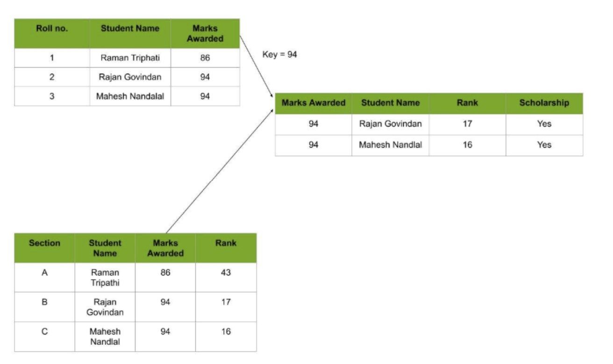
```

.w-100.lh-copy[

>  In this database, every piece of information has a relationship with every other piece of information.
]

---
class: center, inverse, middle

## R and Database 

```{r, out.width= "50%", out.height="40%", echo=FALSE}
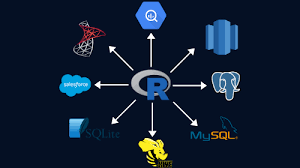
```

[DBI Resource](https://dbi.r-dbi.org/)

---
class: middle

# Power of dbplyr and DBI

> `dbplyr` is the database backend for `dplyr`. It allows you to use remote database tables as if they are in-memory data frames by automatically converting dplyr code into SQL.

The two main libraries we are going to use is: `dbplyr` and `DBI`

```{r eval=FALSE}
library(dbplyr)
library(DBI)
con <- dbConnect(RSQLite::SQLite(), ":memory:")
copy_to(con, starwars)
dbDisconnect(con)

```

---
class: middle

- ⚠️ `dbplyr` is very cool, but will limit your functionality when working in larger teams. Raw SQL is more powerful and easier to maintain.

- 💀 Be careful to only use `dbplyr` for your data pipelines. The package is meant for Data Analysts and Data Scientist who don't do anything with the backend databases. So best used in large teams where roles are clearly defined and you only want to pull data from a database not interact with it in complex ways.

- ⚠️ Call `dbDisconnect()` when finished working with a connection!

---
class: inverse, middle
name: beg6

# Working with simulated DB

---
class: center, middle, inverse

Lets see if our connection worked:

```{r eval=FALSE}
con <- dbConnect(RSQLite::SQLite(), ":memory:")
copy_to(con, breed_traits)
breeds_db <- tbl(con, "breed_traits")
breeds_db
```

---
class: middle

> All dplyr calls are evaluated lazily, generating SQL that is only sent to the database when you request the data!

```{r eval=FALSE}
coat_summary <- breeds_db %>%
  group_by(coat_length) %>%
  summarise(total_shedding = sum(shedding_level))
coat_summary %>%
  show_query()

coat_summary %>%
  collect()
```

---
class: middle

## The most common connectors

> MySQL

```{r eval=FALSE}
RMySQL::MySQL()
```

> PostgreSQL

```{r eval=FALSE}
RPostgreSQL::PostgreSQL()
```

> Oracle

- ⚠️ Here be 🐲s!

```{r eval=FALSE}
ROracle::Oracle()
```

---
class: middle

## Exercise

- Connect to a database.
- Load in Palmer penguins into the database (palmerpenguins::penguins).
- Use the `tbl()` function to make a reference to penguins to ease access to the database.
- Get the average body mass of penguins by sex and species.
- What is the most observed species on every island?
- Disconnect when finished using the connection.

---
class: center, middle, inverse

## Day 3: Automating Report {xaringan}

---
class: middle

.w-100.lh-copy[

Objectives:

> What is `xaringan`?,

> Get started,

> Final Project and Presentation.

]

---
class: large

# Making Slide like a Ninja 🤺

- With xaringan you can easily generate HTML5 presentations.
- The `xaringan` package is an R Markdown extension based on the JavaScript library [remark.js](https://remarkjs.com/).
- To learn more about `xaringan`, review the excellent `xaringan` introduction from the package's author [Yihui Xi](https://bookdown.org/yihui/rmarkdown/xaringan.html).
---
class: large

- As you should know by now, its not very difficult to install packages in R
```{r eval=FALSE}
install.packages("xaringan")
```

- Defining a new slide:

```{r eval=FALSE}
---
class: .large
# Installing {xaringan}
```

- Defining a specific type of slide:

```{r eval=FALSE}
---
class: clear, no_number, transition
# Lets start

```

- [Presentation Ninja](https://bookdown.org/yihui/rmarkdown/xaringan.html)

- [Deployment of Slide Deck](https://rviews.rstudio.com/2021/11/18/deploying-xaringan-slides-a-ten-step-github-pages-workflow/)
---
class: centre

- [Overall Exercise](https://jrnold.github.io/r4ds-exercise-solutions/tidy-data.html)
---
class: centre

**Thank you**

